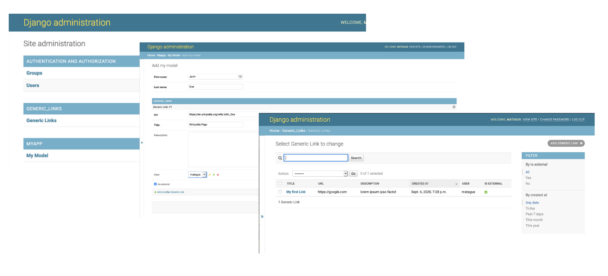
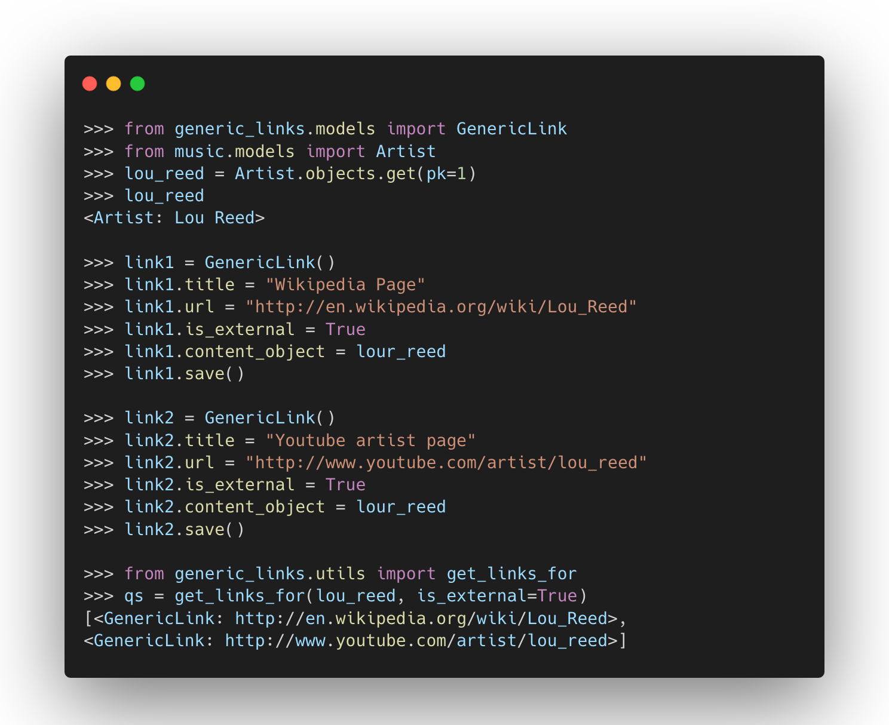
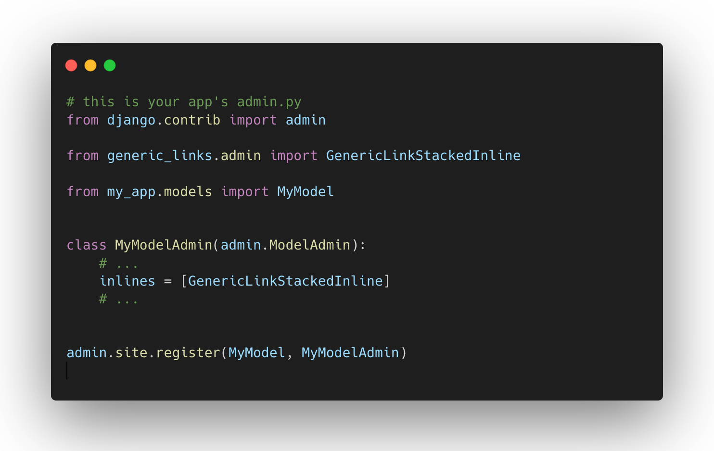
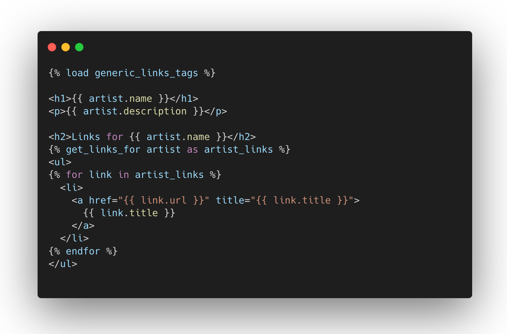

django-generic-links
====================

Simple app to attach links to any Django model. Compatible with Django 1.1x, 2.x and 3.x :)




Features
========

- Model Admin
- Generic inline admin
- A template tag to get all links for a given model instance


Installation
============

Installing `django-generic-links` is fairly easy. You can...

    pip install django-generic-links

...or, you can clone the repo and install it the old fashioned way.

    git clone git://github.com/matagus/django-generic-links.git
    cd django-generic-links
    sudo python setup.py install

then add `generic_links` to your `settings.py`:

``` python
    INSTALLED_APPS = (
        # ...
        'generic_links',
    )
```

and then run the migrations!

    # python manage.py migrate


Usage
=====

Using django-generic-links models
---------------------------------

Imagine you have a music app in your project where you store Artist data. And you
would like to store and display links for each artist, say his facebook page,
his last.fm profile, his youtube artist page and the like:




Generic Links Inline Admin
--------------------------

Since a GenericLink instance will be associated to another object you usally
wish to show an inline model admin form in that model form.




Using django-generic-links templatetags
---------------------------------------

Now imagine you have an artist page. You're passing `artist` object using template
context and you want to get all the links for it:



Development / Contributions
===========================

Running Tests
-------------

Does the code actually work?

    source <YOURVIRTUALENV>/bin/activate
    (myenv) $ pip install tox
    (myenv) $ tox


Development commands
--------------------

    pip install -r requirements_dev.txt
    invoke -l


Want to help?
-------------

If you'd like to help, write example code, contribute patches, document things
on the wiki your help is always appreciated! Just fork the project, clone your
repo, commit, push and send me a pull request


Documentation
=============

The full documentation is at
<https://matagus.alameda.dev/django-generic-links/>.

License
-------

`django-generic-links` is released under an BSD License - see the `LICENSE` file
for more information.


Credits
-------

Tools used in building this package:

-   [Cookiecutter](https://github.com/audreyr/cookiecutter) and [cookiecutter-djangopackage](https://github.com/pydanny/cookiecutter-djangopackage) for rendering this package.
-   [Carbon](https://carbon.now.sh/) for those beautiful code snippets.
